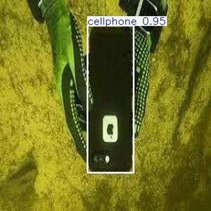
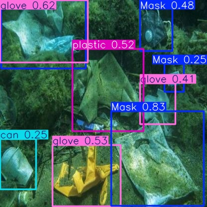
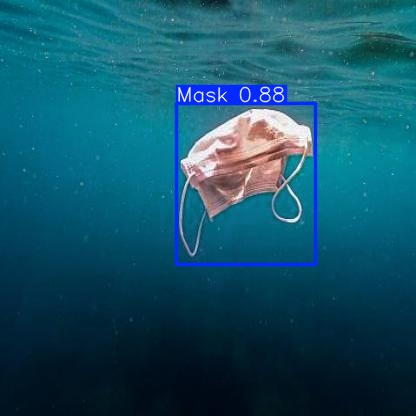
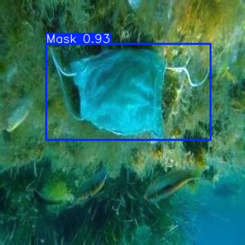

# YOLO-Based Underwater Plastic Detection

This repository contains the **YOLO-Based Underwater Plastic Detection** project, which aims to detect underwater plastic debris using the YOLOv8 Nano model. The project includes a detailed report, source code, and instructions on how to run the system.

---

## 📂 Repository Files

1. **`CSE475_LAB-4_YOLO-Based Underwater Plastic Detection Report_(2021-2-60-052).pdf`**  
   A comprehensive report covering the project’s methodology, dataset, performance evaluation, and results.

2. **`CSE475_LAB-4_YOLO-Based Underwater Plastic Detection Source Code_(2021-2-60-052).py`**  
   Python code implementing the YOLOv8-based object detection system.

---

## 📦 Dataset

The dataset used for this project can be downloaded from Kaggle:  
👉 [Underwater Plastic Pollution Detection Dataset](https://www.kaggle.com/datasets/arnavs19/underwater-plastic-pollution-detection/data)

The dataset is structured into **Train**, **Valid**, and **Test** directories with labeled images for training and validation.

---

## 🛠 How to Run the Project

### Prerequisites

1. Python 3.7 or above  
2. Required libraries:
   - `ultralytics`
   - `opencv-python`
   - `matplotlib`

You can install the necessary libraries using the following command:

```bash
pip install ultralytics opencv-python matplotlib
```

---

### Steps to Run the Project

1. **Clone the repository:**

```bash
git clone https://github.com/your-username/YOLO-Underwater-Plastic-Detection.git
cd YOLO-Underwater-Plastic-Detection
```

2. **Download the dataset from Kaggle** and place it in the appropriate directories (Train, Valid, Test).

3. **Run the source code file:**

```bash
python "CSE475_LAB-4_YOLO-Based Underwater Plastic Detection Source Code_(2021-2-60-052).py"
```

4. **View the results:**  
   - Bounding box predictions and annotated images will be saved in the specified output directory.  
   - Metrics such as precision, recall, and mAP will be logged in the console.

---

## ⚙️ System Components

- **Data Preprocessing:** Enhances contrast using the Dark Prior Channel method.
- **Model Training:** Utilizes YOLOv8 Nano for efficient and accurate detection.
- **Prediction and Visualization:** Draws bounding boxes around detected objects and saves annotated images.


---

## 🏷 Classes Detected

The system detects 15 classes of underwater debris:

1. Mask  
2. Can  
3. Cellphone  
4. Electronics  
5. GBottle (Glass Bottle)  
6. Glove  
7. Metal  
8. Misc  
9. Net  
10. PBag (Plastic Bag)  
11. PBottle (Plastic Bottle)  
12. Plastic  
13. Rod  
14. Sunglasses  
15. Tire  

---

## 📸 Sample Detection Results

### Sample Images from the Output Directory:

  
*Figure 1: Example of detected plastic debris underwater.*

  
*Figure 2: Example of bounding box predictions.*

  
*Figure 3: Annotated image showing detected objects.*

  
*Figure 4: More examples of detected underwater plastics.*

---
